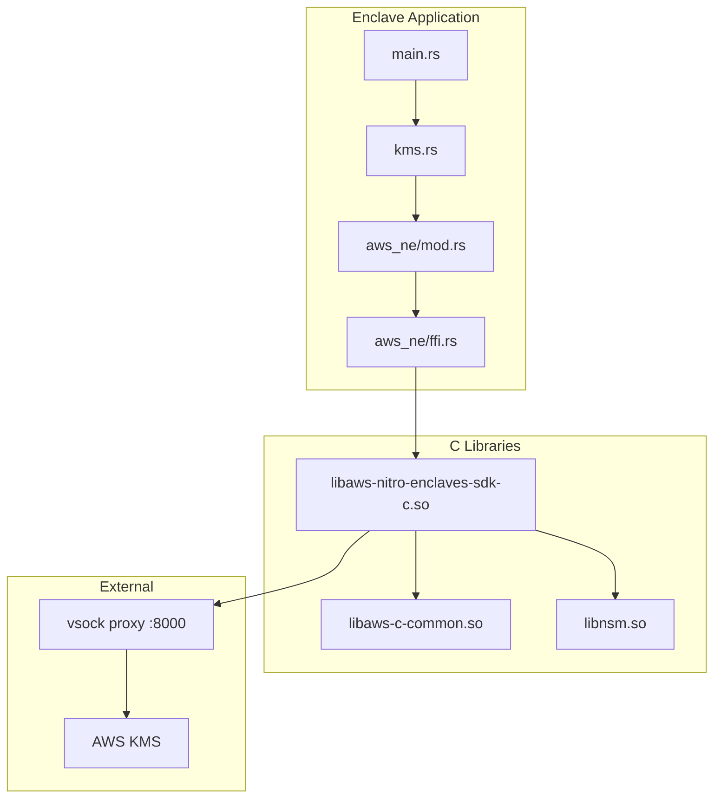
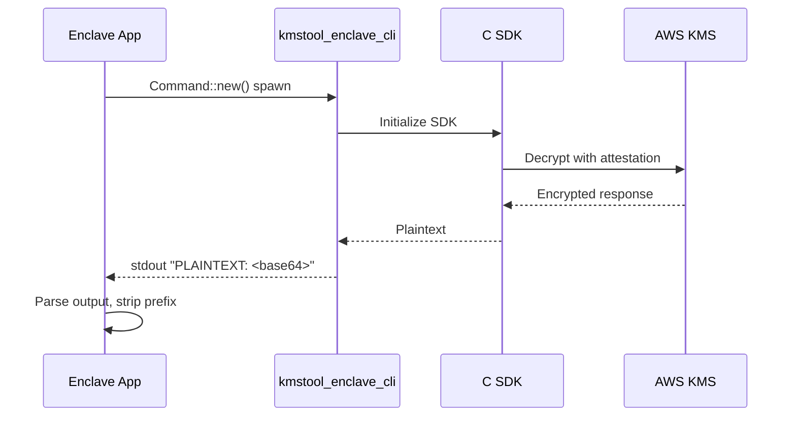
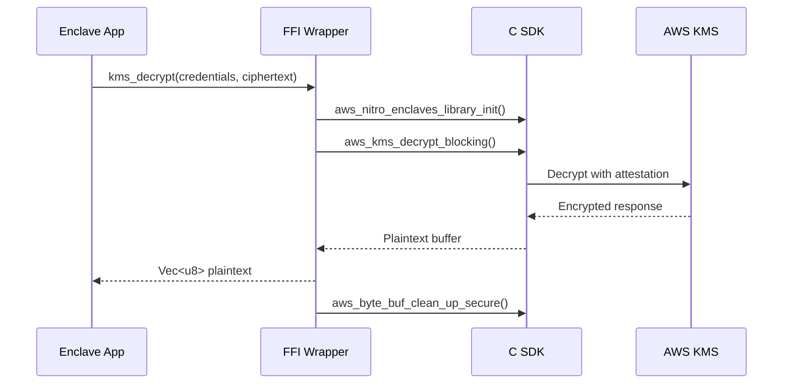
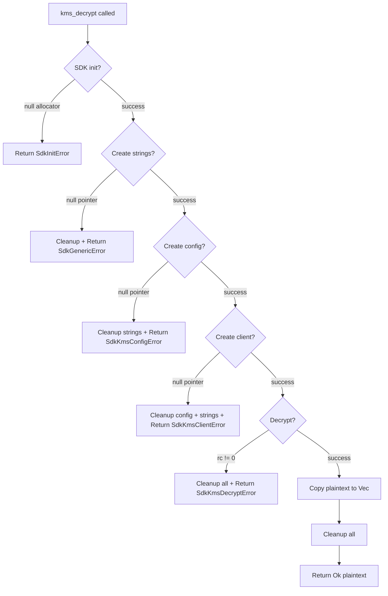

# Design Document: KMS FFI Wrapper

## Overview

This design document describes the implementation of a native Rust FFI wrapper for the AWS Nitro Enclaves SDK C library to replace the current subprocess-based KMS integration (`kmstool_enclave_cli`). The implementation follows the proven pattern from the [aws-nitro-enclaves-acm](https://github.com/aws/aws-nitro-enclaves-acm/tree/main/src/vtok_srv/src/aws_ne) project.

### Goals

1. Eliminate process spawning overhead by calling C SDK functions directly via FFI
2. Improve error handling with typed Rust errors instead of parsing CLI output
3. Reduce Docker image size by removing the `kmstool_enclave_cli` binary
4. Maintain security by using the SDK's secure memory cleanup functions

### Non-Goals

1. Implementing a full Rust SDK for Nitro Enclaves (we only need KMS decrypt)
2. Supporting KMS operations other than decrypt (genkey, genrandom)
3. Abstracting away the C SDK completely (we accept some FFI complexity)

## Architecture



### Current Architecture (Before)



### New Architecture (After)



## Components and Interfaces

### 1. FFI Module (`enclave/src/aws_ne/ffi.rs`)

Low-level FFI declarations for the C SDK. This module contains only `extern "C"` declarations and `repr(C)` struct definitions.

```rust
// Constants
pub const AWS_NE_VSOCK_PROXY_ADDR: [u8; 2] = [0x33, 0x00]; // "3\0" - parent CID
pub const AWS_NE_VSOCK_PROXY_PORT: u16 = 8000;
pub const AWS_SOCKET_VSOCK_DOMAIN: c_int = 3;
pub const AWS_ADDRESS_MAX_LEN: usize = 108;

// Opaque pointer types
#[repr(C)]
pub struct aws_allocator { _ph: [u8; 0] }

#[repr(C)]
pub struct aws_string { _ph: [u8; 0] }

#[repr(C)]
pub struct aws_nitro_enclaves_kms_client { _ph: [u8; 0] }

#[repr(C)]
pub struct aws_nitro_enclaves_kms_client_configuration { _ph: [u8; 0] }

// Concrete structs
#[repr(C)]
pub struct aws_byte_buf {
    pub len: usize,
    pub buffer: *mut u8,
    capacity: usize,
    allocator: *mut aws_allocator,
}

#[repr(C)]
pub struct aws_socket_endpoint {
    pub address: [u8; AWS_ADDRESS_MAX_LEN],
    pub port: u16,
}

// External function declarations
extern "C" {
    // SDK lifecycle
    pub fn aws_nitro_enclaves_library_init(allocator: *mut aws_allocator);
    pub fn aws_nitro_enclaves_library_clean_up();
    pub fn aws_nitro_enclaves_get_allocator() -> *mut aws_allocator;
    
    // String operations
    pub fn aws_string_new_from_array(
        allocator: *mut aws_allocator,
        bytes: *const u8,
        len: usize,
    ) -> *mut aws_string;
    pub fn aws_string_destroy_secure(string: *mut aws_string);
    
    // Buffer operations
    pub fn aws_byte_buf_from_array(bytes: *mut c_void, len: usize) -> aws_byte_buf;
    pub fn aws_byte_buf_clean_up_secure(buf: *mut aws_byte_buf);
    
    // KMS client
    pub fn aws_nitro_enclaves_kms_client_config_default(
        region: *mut aws_string,
        endpoint: *mut aws_socket_endpoint,
        domain: c_int,
        access_key_id: *mut aws_string,
        secret_access_key: *mut aws_string,
        session_token: *mut aws_string,
    ) -> *mut aws_nitro_enclaves_kms_client_configuration;
    
    pub fn aws_nitro_enclaves_kms_client_config_destroy(
        config: *mut aws_nitro_enclaves_kms_client_configuration,
    );
    
    pub fn aws_nitro_enclaves_kms_client_new(
        config: *mut aws_nitro_enclaves_kms_client_configuration,
    ) -> *mut aws_nitro_enclaves_kms_client;
    
    pub fn aws_nitro_enclaves_kms_client_destroy(
        client: *mut aws_nitro_enclaves_kms_client,
    );
    
    pub fn aws_kms_decrypt_blocking(
        client: *mut aws_nitro_enclaves_kms_client,
        key_id: *mut aws_string,
        encryption_algorithm: *mut aws_string,
        ciphertext: *const aws_byte_buf,
        plaintext: *mut aws_byte_buf,
    ) -> c_int;
}
```

### 2. KMS Module (`enclave/src/aws_ne/mod.rs`)

Safe Rust wrapper that encapsulates all unsafe FFI calls.

```rust
mod ffi;

pub enum Error {
    SdkInitError,
    SdkGenericError,
    SdkKmsConfigError,
    SdkKmsClientError,
    SdkKmsDecryptError,
}

/// Decrypt ciphertext using KMS with Nitro Enclave attestation.
/// 
/// This function initializes the SDK, performs decryption, and cleans up
/// all resources before returning.
pub fn kms_decrypt(
    aws_region: &[u8],
    aws_key_id: &[u8],
    aws_secret_key: &[u8],
    aws_session_token: &[u8],
    ciphertext: &[u8],
) -> Result<Vec<u8>, Error>;
```

### 3. Updated KMS Integration (`enclave/src/kms.rs`)

Modified to use the FFI wrapper instead of subprocess.

```rust
use crate::aws_ne;

fn call_kms_decrypt(credential: &Credential, ciphertext: &str, region: &str) -> Result<Vec<u8>> {
    // Base64 decode the ciphertext
    let ciphertext_bytes = base64_decode(ciphertext)?;
    
    // Call FFI wrapper
    aws_ne::kms_decrypt(
        region.as_bytes(),
        credential.access_key_id.as_bytes(),
        credential.secret_access_key.as_bytes(),
        credential.session_token.as_bytes(),
        &ciphertext_bytes,
    )
    .map_err(|e| anyhow!("KMS decrypt failed: {:?}", e))
}
```

### 4. Build Configuration (`enclave/build.rs`)

Links against the C libraries.

```rust
fn main() {
    println!("cargo:rustc-link-lib=dylib=aws-c-common");
    println!("cargo:rustc-link-lib=dylib=aws-nitro-enclaves-sdk-c");
}
```

## Data Models

### Error Enum

```rust
/// Errors that can occur during KMS operations via FFI
pub enum Error {
    /// SDK initialization failed (aws_nitro_enclaves_library_init or get_allocator)
    SdkInitError,
    /// Generic SDK error (string allocation failed)
    SdkGenericError,
    /// KMS client configuration failed
    SdkKmsConfigError,
    /// KMS client creation failed
    SdkKmsClientError,
    /// KMS decrypt operation failed
    SdkKmsDecryptError,
}
```

### FFI Struct Mappings

| C Type | Rust Type | Notes |
|--------|-----------|-------|
| `struct aws_allocator*` | `*mut aws_allocator` | Opaque pointer |
| `struct aws_string*` | `*mut aws_string` | Opaque pointer |
| `struct aws_byte_buf` | `aws_byte_buf` | Concrete struct with len, buffer, capacity, allocator |
| `struct aws_socket_endpoint` | `aws_socket_endpoint` | Concrete struct with address[108], port |
| `struct aws_nitro_enclaves_kms_client*` | `*mut aws_nitro_enclaves_kms_client` | Opaque pointer |
| `struct aws_nitro_enclaves_kms_client_configuration*` | `*mut aws_nitro_enclaves_kms_client_configuration` | Opaque pointer |


## Correctness Properties

*A property is a characteristic or behavior that should hold true across all valid executions of a system-essentially, a formal statement about what the system should do. Properties serve as the bridge between human-readable specifications and machine-verifiable correctness guarantees.*

Based on the prework analysis, most acceptance criteria for this feature are not amenable to property-based testing because:

1. **FFI declarations** (Requirements 1.1-1.5) are verified by successful compilation and linking
2. **Runtime behavior** (Requirements 2.1-2.8, 4.1-4.5, 6.1-6.3) requires a real Nitro Enclave environment with KMS access
3. **Build configuration** (Requirements 5.1-5.3) is verified by Docker build success
4. **Code structure changes** (Requirements 3.1-3.2) are verified by code review

The following properties can be verified:

### Property 1: Vsock endpoint constants are correctly defined

*For any* vsock endpoint configuration, the parent CID SHALL be "3" (0x33) and the proxy port SHALL be 8000.

**Validates: Requirements 2.4**

### Property 2: Error enum is convertible to anyhow::Error

*For any* Error variant returned by the FFI wrapper, it SHALL be convertible to an `anyhow::Error` with a descriptive message.

**Validates: Requirements 3.3**

### Integration Testing Note

Full correctness verification requires integration testing in a Nitro Enclave environment. The following should be verified manually or via integration tests:

1. SDK initialization and cleanup complete without memory leaks
2. KMS decrypt with valid credentials returns expected plaintext
3. KMS decrypt with invalid credentials returns appropriate error
4. All resources are cleaned up on both success and error paths

## Error Handling

### Error Flow



### Cleanup Order

Resources must be cleaned up in reverse order of allocation:

1. `aws_byte_buf_clean_up_secure(&mut plaintext_buf)` - secure erase plaintext
2. `aws_nitro_enclaves_kms_client_destroy(client)` - destroy KMS client
3. `aws_nitro_enclaves_kms_client_config_destroy(config)` - destroy config
4. `aws_string_destroy_secure(session_token)` - secure erase credentials
5. `aws_string_destroy_secure(secret_key)` - secure erase credentials
6. `aws_string_destroy_secure(key_id)` - secure erase credentials
7. `aws_string_destroy_secure(region)` - secure erase region
8. `aws_nitro_enclaves_library_clean_up()` - cleanup SDK

### Error Conversion

```rust
impl From<aws_ne::Error> for anyhow::Error {
    fn from(e: aws_ne::Error) -> Self {
        match e {
            aws_ne::Error::SdkInitError => anyhow!("Failed to initialize Nitro Enclaves SDK"),
            aws_ne::Error::SdkGenericError => anyhow!("SDK memory allocation failed"),
            aws_ne::Error::SdkKmsConfigError => anyhow!("Failed to configure KMS client"),
            aws_ne::Error::SdkKmsClientError => anyhow!("Failed to create KMS client"),
            aws_ne::Error::SdkKmsDecryptError => anyhow!("KMS decrypt operation failed"),
        }
    }
}
```

## Testing Strategy

### Dual Testing Approach

This feature requires both compile-time verification and runtime integration testing:

#### Compile-Time Verification

1. **FFI Bindings**: Verified by successful `cargo build` with linking to C libraries
2. **Type Safety**: Rust compiler ensures correct struct layouts and function signatures
3. **Build Configuration**: Verified by successful Docker build

#### Unit Tests

Unit tests will verify:

1. **Constants**: Vsock endpoint address and port are correctly defined
2. **Error Conversion**: All Error variants convert to descriptive anyhow::Error messages
3. **Struct Layouts**: repr(C) structs have expected sizes (if testable without FFI)

#### Integration Tests (Enclave Environment)

Integration tests must run in a real Nitro Enclave and verify:

1. **Happy Path**: Decrypt with valid credentials returns expected plaintext
2. **Error Paths**: Invalid credentials, network failures return appropriate errors
3. **Resource Cleanup**: No memory leaks (requires valgrind or similar)
4. **Security**: Credentials are securely erased after use

### Property-Based Testing Library

For the limited properties that can be tested, we will use the existing test framework in the enclave crate. No additional PBT library is needed since the testable properties are simple constant checks and error conversion tests.

### Test Annotations

Tests implementing correctness properties will be annotated with:
```rust
// **Feature: kms-ffi-wrapper, Property 1: Vsock endpoint constants are correctly defined**
// **Validates: Requirements 2.4**
#[test]
fn test_vsock_constants() { ... }
```

## Docker Build Changes

### Current Dockerfile (Before)

```dockerfile
# Copy kmstool_enclave_cli
COPY --from=kmstool /usr/bin/kmstool_enclave_cli /app/kmstool_enclave_cli
```

### New Dockerfile (After)

```dockerfile
# Copy shared libraries instead of CLI binary
COPY --from=kmstool /usr/lib/libaws-c-common.so* /usr/lib/
COPY --from=kmstool /usr/lib/libaws-nitro-enclaves-sdk-c.so* /usr/lib/
# ... other required libraries from the SDK build
```

### Library Dependencies

The following shared libraries are required:
- `libaws-c-common.so`
- `libaws-nitro-enclaves-sdk-c.so`
- `libnsm.so` (already included for attestation)
- Additional transitive dependencies from the SDK build

## Migration Path

1. **Phase 1**: Add `aws_ne` module with FFI bindings (no behavior change)
2. **Phase 2**: Update `kms.rs` to use FFI wrapper instead of subprocess
3. **Phase 3**: Update Dockerfile to remove CLI binary and add shared libraries
4. **Phase 4**: Test in Nitro Enclave environment
5. **Phase 5**: Remove old subprocess code
