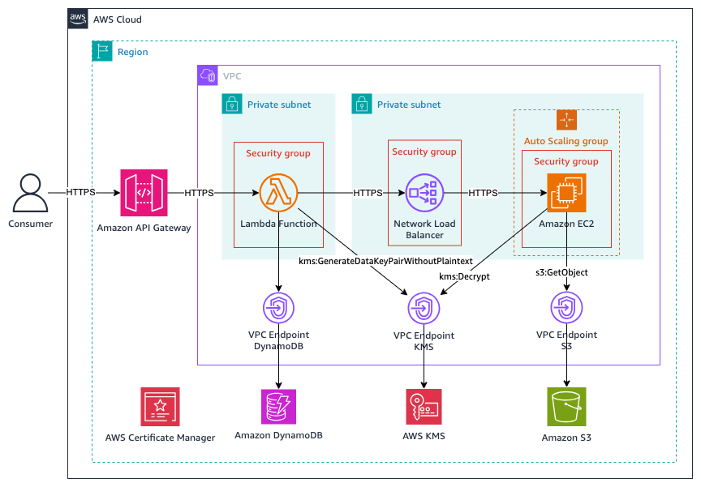

# Architecture

This solution has three components:

## API Tier

* [Amazon API Gateway](https://aws.amazon.com/api-gateway/) is the initial entrypoint into the vault. API Gateway supports both private configurations accessible only from within a VPC, or public access by integrating with an authentication solution such as [Amazon Cognito](https://aws.amazon.com/cognito/) (_Note_: this use case is not supported by this sample).
* [AWS Lambda](https://aws.amazon.com/lambda/) function [written](https://github.com/aws-samples/sample-code-for-a-secure-vault-using-aws-nitro-enclaves/tree/main/api) in [Python](https://python.org) and uses the [Powertools for AWS Lambda](https://docs.powertools.aws.dev/lambda/python/latest/) library to serve the API endpoints. The Lambda function uses Amazon DynamoDB for persistance of metadata and an audit log of vault operations.
* [Amazon DynamoDB](https://aws.amazon.com/dynamodb/) table to persist the vault metadata (public key, encrypted secret key, encrypted attributes) and audit log.

## Decryption Tier

* [Amazon EC2](https://aws.amazon.com/ec2/) instances are launched in an [Amazon EC2 Auto Scaling](https://aws.amazon.com/ec2/autoscaling/) group using [launch templates](https://docs.aws.amazon.com/autoscaling/ec2/userguide/launch-templates.html).
* [Network Load Balancer](https://aws.amazon.com/elasticloadbalancing/network-load-balancer/) (NLB) is configured to pass-through encrypted TLS (port 443) traffic to the EC2 instances (the NLB is not terminating TLS)
* [NGINX](https://nginx.org/en/) is used as the web server listening on port 443 and terminates TLS connections for the parent application.
* [AWS Certificate Manager](https://aws.amazon.com/certificate-manager/) and the [AWS Certificate Manager for Nitro Enclaves](https://docs.aws.amazon.com/enclaves/latest/user/nitro-enclave-refapp.html) reference application are used to automatically provision certificates for NGINX and secures the private key inside an enclave.
* [Vsock Proxy](https://github.com/aws/aws-nitro-enclaves-cli/blob/main/vsock_proxy/README.md) implements a proxy server that runs on the parent instance and forwards vsock traffic from an enclave to the [AWS Key Management Service](https://aws.amazon.com/kms/).
* [Parent Application](https://github.com/aws-samples/sample-code-for-a-secure-vault-using-aws-nitro-enclaves/tree/main/parent) written in [Rust](https://www.rust-lang.org/) that retrieves IAM credentials from the EC2 instance (using IMDSv2) and forwards the decryption request to the enclave over a vsock connection and then sends the response back to the caller (the Lambda function).

## Enclave Tier

Runs within a Nitro Enclave on an EC2 instance.

* [kmstool-enclave-cli](https://github.com/aws/aws-nitro-enclaves-sdk-c/blob/main/bin/kmstool-enclave-cli/README.md) is used to decrypt the secret key using AWS KMS with the IAM credentials included in the request.
* [Enclave Application](https://github.com/aws-samples/sample-code-for-a-secure-vault-using-aws-nitro-enclaves/tree/main/enclave) written in [Rust](https://www.rust-lang.org/) that decrypts the secret key in the request, then decrypts each encrypted attribute that was provided in the request. Attributes can be transformed using the [Common Expression Language](https://github.com/google/cel-spec) (CEL).
