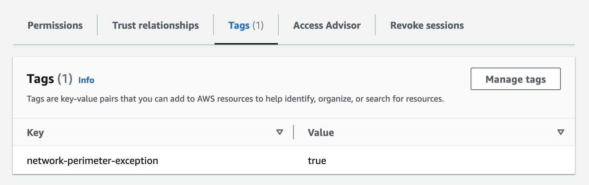
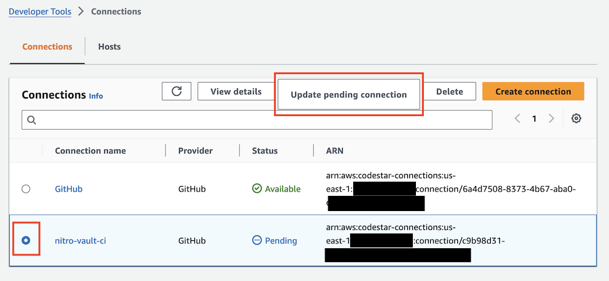

# Deploying the Solution

The solution is developed using [AWS CloudFormation](https://aws.amazon.com/cloudformation/), [Python](https://python.org), and [Rust](https://www.rust-lang.org/).

## Prerequisites

* You will need an [AWS Account](https://repost.aws/knowledge-center/create-and-activate-aws-account).
* [AWS CLI](https://aws.amazon.com/cli/) installed and configured to use with your AWS account.
* Either an [IAM User](https://console.aws.amazon.com/iamv2/home?#/users/create) or [IAM Identity Center User](https://aws.amazon.com/iam/identity-center/) with the `AdministratorAccess` policy granted to your user. *Not recommended for a production environment.*

!!! info
    The solution includes a CloudFormation template called [deploy_template.yml](https://github.com/aws-samples/sample-code-for-a-secure-vault-using-aws-nitro-enclaves/blob/main/deploy_template.yml) that will create an IAM role with the necessary permissions to deploy this solution.

    After deploying the CloudFormation template, you can [use an IAM role with the AWS CLI](https://docs.aws.amazon.com/cli/latest/userguide/cli-configure-role.html) by configuring an additional profile in `~/.aws/config` such as:

    ```
    [profile nitro-vault]
    role_arn=arn:aws:iam::123456789012:role/nitro-vault-deployment-rDeploymentRole-XXXXXXXX
    source_profile=default
    role_session_name=nitro-vault
    ```

    Then in step #2 below, set `AWS_PROFILE=nitro-vault` to use the new profile.

## Deployment

1. GitHub: [Fork the repository to your personal account](https://docs.github.com/en/pull-requests/collaborating-with-pull-requests/working-with-forks/fork-a-repo#forking-a-repository). This is required so AWS CodePipeline can access the repository and checkout the source code.

    ```shell
    git clone https://github.com/<YourGitHubUserName>/sample-code-for-a-secure-vault-using-aws-nitro-enclaves
    cd sample-code-for-a-secure-vault-using-aws-nitro-enclaves
    cp .env.template .env
    ```

2. Edit the `.env` file and set these variables:

    | Variable    | Default  | Description |
    | ----------- | :------: | ----------- |
    | AWS_PROFILE | - | The name of the AWS CLI profile with the credentials and options to use. |
    | AWS_REGION  | - | The AWS SDK compatible environment variable that specifies the AWS Region to send the request to. |
    | HOSTED_ZONE_ID | - | Amazon Route 53 Hosted Zone ID |
    | DOMAIN_NAME | - | Sub-domain to create in the HOSTED_ZONE_ID for the internal vault API |
    | GITHUB_REPO | - | Personal fork of this repository (ex. aws-samples/sample-code-for-a-secure-vault-using-aws-nitro-enclaves) |

    !!! info
        The `HOSTED_ZONE_ID` and `DOMAIN_NAME` are required because the solution issues a valid SSL/TLS certificate managed by the [AWS Certificate Manager](https://aws.amazon.com/certificate-manager/) (ACM) for use on the EC2 instances for the Nitro Enclaves. The private key of the certificate is securely managed by [ACM for Nitro Enclaves](https://docs.aws.amazon.com/enclaves/latest/user/nitro-enclave-refapp.html) and [NGINX](https://nginx.org). ACM for Nitro Enclaves takes care of automatically rotating the certificate.

2. You must add a new [tag](https://docs.aws.amazon.com/IAM/latest/UserGuide/id_tags.html) to the AWS IAM Principal (either an IAM User or IAM Role) you are using to deploy this solution. If you are using the IAM role created in the `deploy_template.yml` CloudFormation template, then this step has already been completed for you.

    

    Create a new tag key called `network-perimeter-exception` with a value of `true`.

    !!! info
        This solution implements best practices regarding [data perimeters on AWS](https://aws.amazon.com/identity/data-perimeters-on-aws/). To learn more about building a data perimeter, please consult the [Building a Data Perimeter on AWS](https://docs.aws.amazon.com/whitepapers/latest/building-a-data-perimeter-on-aws/building-a-data-perimeter-on-aws.html) whitepaper.

3.  Execute the `deploy.sh` shell script to begin the deployment.

    ```shell
    > ./deploy.sh

    [!] Deploying nitro-vault-vpc stack...
    Waiting for changeset to be created..
    Waiting for stack create/update to complete
    Successfully created/updated stack - nitro-vault-vpc

    [!] Deploying nitro-vault-key stack...
    Waiting for changeset to be created..
    Waiting for stack create/update to complete
    Successfully created/updated stack - nitro-vault-key

    [!] Deploying nitro-vault-ci stack...
    Waiting for changeset to be created..
    Waiting for stack create/update to complete
    Successfully created/updated stack - nitro-vault-ci

    [!] Updating nitro-vault-key stack with deployed Step Functions role...
    Waiting for changeset to be created..
    Waiting for stack create/update to complete
    Successfully created/updated stack - nitro-vault-key
    [?] Do you want to create a new private signing key for AWS Nitro Enclaves? (y/n) y

    [+] Updating secret in AWS SecretsManager with private signing key...
    {
        "ARN": "arn:aws:secretsmanager:us-east-1:123456789012:secret:rSigningSecret-XXXXXXXXX",
        "Name": "rSigningSecret-XXXXXXXXX",
        "VersionId": "ba6a5637-d579-4811-a1de-XXXXXXXXX"
    }

    [+] Opening AWS Console to complete set up AWS CodeConnections to GitHub...
    [?] Select the radio button next to nitro-vault-ci and then click on "Update pending connection"
    [!] Waiting for pipeline to complete...

    [!] Pipeline in progress, sleeping 5 seconds...
    [!] Pipeline in progress, sleeping 5 seconds...
    [!] Pipeline in progress, sleeping 5 seconds...
    ...
    ```

    !!! attention
        You must update the pending connection prior to triggering the AWS CodePipeline or else it won't be able to check out the source code from GitHub.

    

    Select the `nitro-vault-ci-<region>` AWS CodeConnections connection and click `Update pending connection` to link it to your GitHub account. After you have succesfully linked your GitHub account, press any key to start the CodePipeline.

    ```shell
    ...
    [!] Pipeline in progress, sleeping 5 seconds...
    [!] Pipeline in progress, sleeping 5 seconds...
    [!] Pipeline in progress, sleeping 5 seconds...
    [+] Pipeline finished successfully.
    [+] Opening Swagger UI at https://xxxxxxx.execute-api.region.amazonaws.com/v1/swagger...
    [+] Done!%
    ```

---

The installation script does the following:

1. Deploys a CloudFormation [VPC template](https://github.com/aws-samples/sample-code-for-a-secure-vault-using-aws-nitro-enclaves/blob/main/vpc_template.yml) to create a VPC with two private subnets across two availability zones (default stack name is `nitro-vault-vpc`)
2. Deploys a CloudFormation [KMS template](https://github.com/aws-samples/sample-code-for-a-secure-vault-using-aws-nitro-enclaves/blob/main/kms_template.yml) to create a KMS key (default stack name is `nitro-vault-key`)
3. Deploys a CloudFormation [CI template](https://github.com/aws-samples/sample-code-for-a-secure-vault-using-aws-nitro-enclaves/blob/main/ci_template.yml) to create a CodePipeline and four CodeBuild projects to build the various application components and deploy the EC2 instances and API (default stack name is `nitro-vault-ci`)

## Post Deployment Guidance

Once you have completed the deployment, follow the [Post Deployment Guide](./post-deployment.md).
