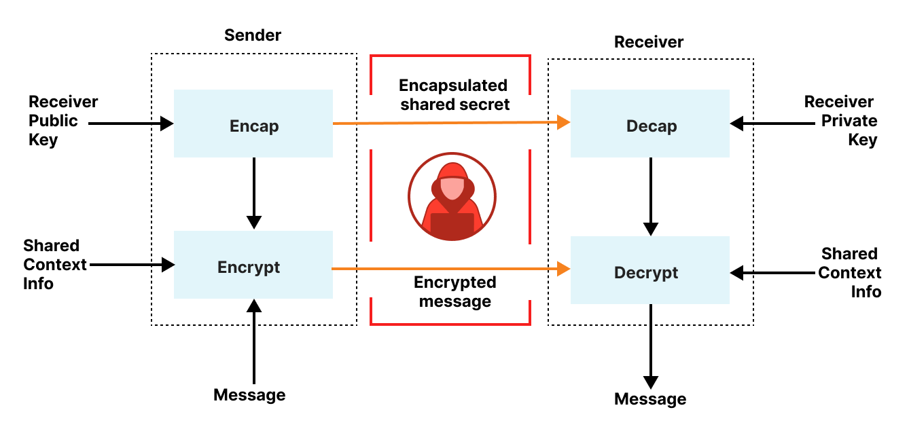

# Security

This application employs Hybrid Public Key Encryption (HPKE) [[RFC-9180](https://www.rfc-editor.org/rfc/rfc9180.html)] to encrypt data using `DHKEM(P-384, HKDF-SHA384), HKDF-SHA384, AES-256-GCM`.

* Encryption of data is handled by [hpke-py](https://github.com/ctz/hpke-py) in the [API](https://github.com/aws-samples/sample-code-for-a-secure-vault-using-aws-nitro-enclaves/tree/main/api).
* Decryption of data is handled by [rustls](https://github.com/rustls/rustls) that uses [AWS-LC](https://github.com/aws/aws-lc) for cryptographic operations (through [aws-lc-rs](https://github.com/aws/aws-lc-rs)) in the [enclave](https://github.com/aws-samples/sample-code-for-a-secure-vault-using-aws-nitro-enclaves/tree/main/enclave).

## Best Practices

### Data Perimeters

This solution implements the recommended practices for [resource based policies](https://github.com/aws-samples/data-perimeter-policy-examples/tree/main/resource_based_policies) and [VPC endpoint policies](https://github.com/aws-samples/data-perimeter-policy-examples/tree/main/vpc_endpoint_policies) to ensure only trusted identities can access the trusted resources from expected networks.

### Permissions Boundaries

This solution deploys an [IAM permissions boundary](https://docs.aws.amazon.com/IAM/latest/UserGuide/access_policies_boundaries.html) policy on all provisioned IAM roles to prevent priviledge escalation if an attacker were able to escalate privileges on the role.

### Code Signing

All deployed Lambda functions have their [code signed with AWS Signer](https://docs.aws.amazon.com/lambda/latest/dg/governance-code-signing.html) to prevent modifications to the Lambda code after deployment.

### DNS Firewall

An optional [Route 53 Resolver DNS Firewall](https://docs.aws.amazon.com/Route53/latest/DeveloperGuide/resolver-dns-firewall.html) is configured by default to only allow DNS queries to `*.amazonaws.com` and the domain for the internal Network Load Balancer.

### Identity Canaries

Two additional Lambda functions are deployed, one attached to the same VPC as the API Lambda function, and one not attached to any VPCs, that execute every minute attempting to calling `kms:Decrypt` against the first encrypted secret key found in DynamoDB. If the KMS key policy is inadvertantly modified to where the KMS Decrypt call succeeds, then a CloudWatch Alarm will be triggered.

## Threat Model

To view the threat model, you can use [threat-composer](https://awslabs.github.io/threat-composer/) to load [NitroVault_ThreatComposer.json](https://github.com/aws-samples/sample-code-for-a-secure-vault-using-aws-nitro-enclaves/blob/main/docs/NitroVault_ThreatComposer.json)
